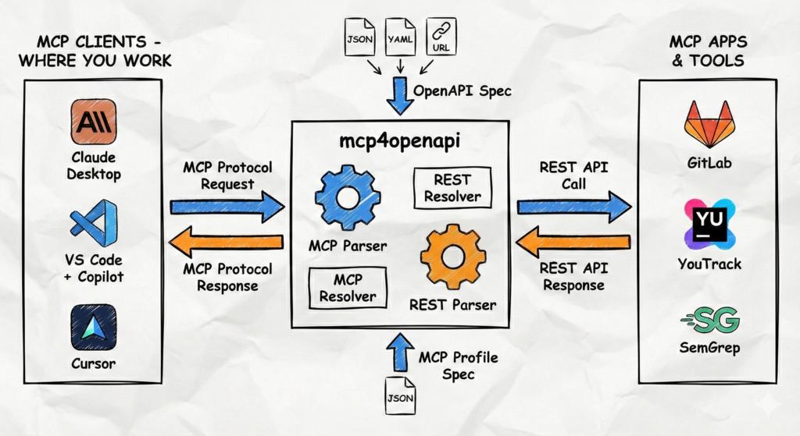

# MCP for OpenAPI

[](https://github.com/davidruzicka/mcp4openapi/actions/workflows/ci.yml)
[](https://codecov.io/gh/davidruzicka/mcp4openapi)
[](https://www.npmjs.com/package/mcp4openapi)
[](https://hub.docker.com/r/mcp4openapi/mcp4openapi)
[](./LICENSE.md)

Turn any OpenAPI specification into a smaller, LLM-friendly MCP server.

## At a Glance

- **Input**: any OpenAPI 3.x spec
- **Shaping layer**: optional MCP profile to reduce tools, rename parameters, compose workflows, and trim responses
- **Output**: MCP tools exposed over `stdio` or HTTP

[](docs/mcp4openapi-principle.png)

## How It Works

| Step | What happens | Why it matters |
| --- | --- | --- |
| 1. Load API | `mcp4openapi` reads your OpenAPI spec | Raw REST operations become available for tool generation |
| 2. Shape tools | A profile can group, filter, and simplify operations | The LLM sees fewer, more useful tools |
| 3. Connect client | Your MCP client connects over `stdio` or HTTP | You use the API through MCP without custom server code |

Typical outcomes:
- Fewer tools and smaller responses, so the LLM keeps more relevant context
- One server with multiple profiles for dev, staging, prod, or role-specific access
- Reusable higher-level workflows with composite tools and prompt definitions

Start with an existing profile in [`profiles/`](./profiles), then adapt only what you need.

## Start Here

- **I want to try it fast**: jump to [Quick Start](#quick-start) and use an existing bundled profile.
- **I need remote access or OAuth**: use [HTTP transport](./docs/HTTP-TRANSPORT.md) and [OAuth setup](./docs/OAUTH.md).
- **I want custom tool design**: start with the [Profile Guide](./docs/PROFILE-GUIDE.md).
- **I want the autonomous-agent machine contracts**: see [Agent Output Schemas](./docs/AGENT-OUTPUT-SCHEMAS.md) and [Autonomous Agents](./docs/AUTONOMOUS-AGENTS.md).

## Core Capabilities

- **Any OpenAPI API**: works with OpenAPI 3.x specifications
- **Profiles**: transform raw APIs into LLM-friendly MCP tools in [MCP profiles](docs/PROFILE-GUIDE.md)
- **Tool aggregation**: reduce tool clutter by grouping related operations
- **Composite actions**: chain API calls into reusable workflows
- **Prompt definitions**: add reusable MCP prompts directly in profiles
- **MCP Apps resources**: expose static or fetch-backed `resources/list`, `resources/templates/list`, `resources/read`, and template-variable completion from profiles
- **Upstream MCP provider config**: profiles can declare remote HTTP streamable MCP upstreams (schema and validation first; transport execution follows in later roadmap issues)
- **Consent-gated upstreams**: required consent is bound to the verified OIDC subject, issuer, tenant, profile, and rules version; local-only profiles cannot enable it
- **OAuth 2.0**: browser-based auth flow for HTTP transport (see [docs/OAUTH.md](./docs/OAUTH.md))
- **Enterprise managed authorization**: inbound JWT bearer grant for HTTP transport with profile-driven issuer/JWKS policy and opaque MCP access tokens (see [docs/OAUTH.md](./docs/OAUTH.md))
- **Multi-auth**: combine multiple auth methods with priority fallback (see [docs/MULTI-AUTH.md](./docs/MULTI-AUTH.md))
- **Multipart uploads**: `HttpClient` handles `multipart/form-data`
- **Observability**: structured logging with secrets redaction and Prometheus metrics

## Security Note

- DNS rebinding protection: when binding to localhost (`127.0.0.1`/`::1`), the HTTP transport enforces Host header validation and returns `403 { "error": "Forbidden" }` on mismatch. This mitigates browser-based DNS rebinding attacks against local development servers.
- For remote deployments, bind to an explicit interface or place the server behind a reverse proxy that enforces strict Host checks and origin allowlists.

Check example profiles in [profiles/](https://github.com/davidruzicka/mcp4openapi/tree/main/profiles).

## Upstream MCP roadmap config

Profiles declare a single `upstream_mcp` object for a remote MCP provider, or resolve it from an env-backed JSON object via `upstream_mcp_from_env`.

- Supported transport in the first iteration: `transport.type: "http-streamable"`
- Supported upstream auth subset: `bearer`, `query`, `custom-header`
- Secrets must be referenced with `value_from_env`; inline credentials are rejected
- If `upstream_mcp_from_env` is set and resolves to non-empty JSON, it overrides the static `upstream_mcp` connection details; a static `tools.allow` or `tools.deny` policy must be preserved and cannot be broadened or removed
- An unset `upstream_mcp_from_env` variable does not count as an effective upstream for a required consent gate
- `stdio` upstream providers are intentionally deferred to a later, explicitly gated iteration

Example:

```json
{
  "upstream_mcp_from_env": "MCP4_UPSTREAM_MCP_JSON",
  "upstream_mcp": {
    "name": "remote-mcp",
    "transport": {
      "type": "http-streamable",
      "url": "https://remote-mcp.example/mcp"
    },
    "auth": {
      "type": "bearer",
      "value_from_env": "REMOTE_MCP_TOKEN"
    },
    "tool_prefix": "remote",
    "tools": {
      "allow": ["github_*"],
      "deny": ["admin_*"]
    },
    "timeout_ms": 30000
  }
}
```

Use the env-backed path when deployment-specific upstreams differ between environments and you do not want to edit the checked-in profile file.

For a required `consent_gate`, the resolved profile must contain an effective upstream MCP provider and must not contain local `tools[]`. Consent evidence is recorded only after OIDC verification and is matched against the verified subject, canonical issuer, tenant context, profile ID, and current `rules_version`.

## MCP Apps Profiles

Profiles can now declare top-level `resources[]` for MCP Apps UIs and read-only data surfaces:
- fixed resources with `uri` and preloaded `file_path` or bounded `inline_text`
- template resources with `uri_template`, optional variable completion, and optional fetch-backed rendering through declared read-only OpenAPI/composite bindings
- tool-level `apps` metadata to attach output templates and widget metadata without changing the core tool schema generator

See [docs/PROFILE-GUIDE.md](./docs/PROFILE-GUIDE.md) for the profile shape and validation rules.

## Quick Start

For most users, the simplest path is:

1. Pick a bundled profile such as `gitlab`, `codecov`, or `n8n`.
2. Start `mcp4openapi` with `npx`.
3. Paste one matching MCP client config below.

Minimal local example:

```bash
export MCP4_API_TOKEN=your_token
npx mcp4openapi --profile gitlab --api-base-url https://gitlab.example.com/api/v4
```

If you already know your MCP client, go straight to its config example. If not, use the file-location section first.

### Configuration File Locations

**Cursor:**
- **Project-Specific:** `.cursor/mcp.json` in your project root
- **Global:** user profile configuration (for example Linux `~/.config/Cursor/User/mcp.json`; use `⚙` → `Tools & MCP` → `New MCP Server`)

**VS Code + Copilot:**
- **Project-Specific:** `.vscode/mcp.json` in your project root
- **Global:** `~/.config/Code/User/mcp.json` in your home directory (platform-dependent; use `Ctrl+Shift+P` → `MCP: Open User Configuration`)

**JetBrains IDEs + Copilot:**
- **Project-Specific:** `.idea/mcp.json` in your project root
- **Global:** `~/.config/github-copilot/intellij/mcp.json` (platform-dependent; use GitHub Copilot icon bottom right → `Edit Setting...` → `Model Context Protocol (MCP)` → `Configure`)

**Claude Code:**
- **Project-Specific:** `.claude/mcp.json` in your project root
- **Global:** `~/.claude.json` in your home directory (platform-dependent)

### Option A: npx

No installation required.

#### VS Code + Copilot example:

Use VS Code dialog to enter access token (recommended for security):

Access Token (Bearer) example:
```json
{
    "servers": {
        "mcp4openapi": {
            "command": "npx",
            "args": [
                "-y", "mcp4openapi",
                "--profile", "<profile-name>",
                "--api-base-url", "https://api.example.com"
            ],
            "env": {
                "MCP4_API_TOKEN": "${input:api-token}",
            }
        },
        "inputs": [
            {
                "type": "promptString",
                "id": "api-token",
                "description": "API Authorization Token",
                "password": true
            }
        ]
    }
}
```

_`inputs` section prompts you for the token when the server starts, so environment variables are not needed._

#### Cursor examples

Cursor stdio example (non-OAuth, token-based auth only):

```json
{
    "mcpServers": {
        "mcp4openapi": {
            "command": "npx",
            "args": [
                "-y", "mcp4openapi",
                "--profile", "<profile-name>",
                "--api-base-url", "https://api.example.com"
            ],
            "env": {
                "MCP4_API_TOKEN": "${env:MCP4_API_TOKEN}",
            }
        }
    }
}
```

Cursor OAuth example (HTTP transport, URL-based MCP server):

```json
{
    "mcpServers": {
        "mcp4openapi-oauth": {
            "url": "http://127.0.0.1:3003/profile/<profile-name>/mcp"
        }
    }
}
```

#### Profile shortcut

If profile defines `profile_id` (or `profile_name` or `profile_alias`), you can start with:

```bash
npx mcp4openapi --profile (profile-id/name/alias)
```

List available profiles with:

```bash
npx mcp4openapi --list-profiles
npx mcp4openapi -l
```

Show standard CLI info with:

```bash
npx mcp4openapi --help
npx mcp4openapi -h
npx mcp4openapi --version
npx mcp4openapi -v
```

Predefined profiles in the `profiles/` directory contains names for easy reference:
- GitLab profile: `gitlab`
- YouTrack profile: `youtrack`
- Codecov profile: `codecov`
- GitHub security profile: `github-security`
- SemGrep profile: `semgrep`
- Grafana profile: `grafana`
- n8n profile: `n8n`
- n8n simple node listing profile: `n8n-nodes`
- DefectDojo profile: `defectdojo`

Profiles are resolved from `./profiles` path by default. If that directory is missing, the bundled npm package profiles are used. Override with `--profiles-dir` or `MCP4_PROFILES_DIR`.

The Softeria SharePoint profile (`softeria-sharepoint`, alias `ms365-sharepoint`) lives in the internal deployment repository; this repo keeps only a reference test fixture at `tests/profiles/softeria-sharepoint/` that exercises consent-gated upstream loading. The Softeria profile requires HTTP transport and profile OAuth. Set a single-tenant Entra issuer, app credentials, callback URI, durable consent evidence path, and deployment-specific upstream object. Run the pinned Softeria version with `--org-mode --read-only` and an anchored exact `--enabled-tools` catalog matching the gateway allow-list. Before rolling out a new upstream version, capture its tool catalog with `--read-only --org-mode --allow-unauthenticated-discovery --http 127.0.0.1:<port>` followed by an MCP `initialize` and `tools/list`, and confirm every allow-list entry is present; `--list-permissions` reports Graph scopes only and lists no tool names. See [Profile Guide](docs/PROFILE-GUIDE.md#validating-the-softeria-sharepoint-tool-catalog) for the full procedure and the committed catalog fixture.

##### ⚠️ Prerequisites

- `MCP4_API_TOKEN` (or equivalent environment variable name defined in your profile) with access token (Bearer) must be set for stdio transport with authenticated APIs. OAuth authorization flow is supported for HTTP transport only.

#### Claude Code example:

```bash
claude mcp add --transport stdio mcp4openapi \
  -- npx mcp4openapi --profile <profile-name> --api-base-url https://api.example.com
```

##### ⚠️ Prerequisites

- `MCP4_API_TOKEN` with access token (Bearer) must be set.

#### JetBrains IDEs + Copilot example:

```json
{
    "servers": {
        "mcp4openapi": {
            "command": "npx",
            "args": [
                "mcp4openapi",
                "--profile",
                "<profile-name>",
                "--api-base-url",
                "https://api.example.com"
            ],
            "env": {
                "MCP4_API_TOKEN": "${input:api-token}",
            }
        }
    }
}
```

##### Note

- JetBrains IDEs show ⚠️ right next to `${input:api-token}` to indicate that you need to enter the token manually in the IDE dialog.

### Option B: Docker

See [docs/DOCKER.md](./docs/DOCKER.md) for build, run, authentication modes, production deployment, and security.

## Local Development

**1. Clone & Install:**
```bash
git clone https://github.com/davidruzicka/mcp4openapi.git
cd mcp4openapi
npm install
```

**2. Build:**
```bash
npm run build
```

**3. Configure:**
```bash
cp env.example .env
# Edit .env with your settings
```

**4. Run:**
```bash
# uses .env for configuration
npm start
```

- alternatively, run with CLI flags:
```bash
export MCP4_API_TOKEN=glpat-xxxxxxxxxxxx
npm start --profile mcp-profile
```

See [docs/HTTP-TRANSPORT.md](./docs/HTTP-TRANSPORT.md) for transport options (stdio vs HTTP) and authentication modes.

## Custom CA Certificates

Node.js has a fixed list of certificate authorities. If your MCP server uses self-signed certificates, you need to configure Node.js to trust them.

### Linux

**Option 1: Disable certificate validation (test only)**

```bash
export NODE_TLS_REJECT_UNAUTHORIZED=0
# Persist for current user
echo 'export NODE_TLS_REJECT_UNAUTHORIZED=0' >> $HOME/.profile
```

**Option 2: Add custom CA to Node.js**

```bash
export NODE_EXTRA_CA_CERTS=$HOME/ca-bundle.pem
# Persist for current user
echo 'export NODE_EXTRA_CA_CERTS="$HOME/ca-bundle.pem"' >> $HOME/.profile
```

### Windows (PowerShell)

**Option 1: Disable certificate validation (test only)**

```powershell
# Session only
$env:NODE_TLS_REJECT_UNAUTHORIZED = "0"
# Persist for current user
setx NODE_TLS_REJECT_UNAUTHORIZED 0
```

**Option 2: Add custom CA to Node.js**

```powershell
# Session only
$env:NODE_EXTRA_CA_CERTS = "$env:USERPROFILE\ca-bundle.pem"
# Persist for current user
setx NODE_EXTRA_CA_CERTS "%USERPROFILE%\ca-bundle.pem"
```

### macOS (zsh/bash)

**Option 1: Disable certificate validation (test only)**

```bash
# Session only
export NODE_TLS_REJECT_UNAUTHORIZED=0
# Persist for current user (zsh)
echo 'export NODE_TLS_REJECT_UNAUTHORIZED=0' >> $HOME/.zshrc
# or for bash
echo 'export NODE_TLS_REJECT_UNAUTHORIZED=0' >> $HOME/.bash_profile
```

**Option 2: Add custom CA to Node.js**

```bash
# Session only
export NODE_EXTRA_CA_CERTS="$HOME/ca-bundle.pem"
# Persist for current user (zsh)
echo 'export NODE_EXTRA_CA_CERTS="$HOME/ca-bundle.pem"' >> $HOME/.zshrc
# or for bash
echo 'export NODE_EXTRA_CA_CERTS="$HOME/ca-bundle.pem"' >> $HOME/.bash_profile
```

## Environment Variables

### Required
- `MCP4_API_TOKEN`: API token (default env var name; customizable via `MCP4_AUTH_ENV_VAR` or profile `value_from_env` for auth parameters)
  - **Required for stdio** mode with authenticated APIs
  - **Optional for HTTP** mode with per-session tokens sent in HTTP headers
  - When using no profile mode, auth type is auto-detected from OpenAPI `security` schemes if present

### Required for profiles with `consent_gate.required`

A durable evidence backend and `MCP4_OAUTH_KEY` are mandatory for a profile that declares
`consent_gate.required: true`. Startup fails with a `ConfigurationError` if either is missing;
there is no degraded mode.

- Evidence backend (one of, Postgres wins when both are set):
  - `MCP_CONSENTS_DB_HOST`, `MCP_CONSENTS_DB_PORT` (default `5432`), `MCP_CONSENTS_DB_NAME`,
    `MCP_CONSENTS_DB_USER`, `MCP_CONSENTS_DB_PASSWORD`: PostgreSQL-backed transactional store for
    multi-replica deployments. Append-only audit table (`consent_evidence`), created on first use.
    A partial variable set is a hard `ConfigurationError`, never a silent fallback.
    TLS is on by default (`require` semantics — managed Postgres endpoints expect encrypted
    connections); set `MCP_CONSENTS_DB_SSL=false` only for local development.
  - `MCP4_CONSENT_EVIDENCE_PATH`: Absolute writable path of the append-only JSONL consent evidence
    file (durable single-node/staging store).
  Missing both -> `Required consent gate needs a durable evidence store: set the MCP_CONSENTS_DB_* variables or MCP4_CONSENT_EVIDENCE_PATH`.
  The in-memory store is used only when no profile requires consent (dev and tests): volatile storage
  would drop every grant on restart while still reporting "consent recorded".
- `MCP4_OAUTH_KEY`: Symmetric key for the encrypted token envelopes. Missing value ->
  `Required consent gate needs MCP4_OAUTH_KEY so verified identity survives a gateway restart`. Without
  it the gateway cannot issue `mcp4.r1.*` refresh envelopes, so after a restart every refresh would
  produce a session with no verified human principal.

A consent-gated profile additionally needs a profile OAuth interceptor with a concrete `issuer`,
`client_id`, `redirect_uri` and the `openid` scope, an effective `upstream_mcp` provider, and no local
`tools[]`.

**Consent policy fields** (profile `consent_gate` block, see [Profile Guide](docs/PROFILE-GUIDE.md#consent-gated-upstream-mcp)):

- `rules_version` (required): bumping it invalidates prior consent and forces re-acceptance.
- `max_age_days` (optional): a grant older than this many days stops satisfying the gate and the user
  must accept again. Omitted means grants never expire on age.
- `rules_summary` / `education_resource` (optional): both are covered by `rules_hash`
  (sha256 over `rules_version` + `rules_summary` + `education_resource`). **Editing either one
  invalidates every existing grant** even without a `rules_version` bump, because a stored grant no
  longer matches what the gateway now renders. Plan wording changes as re-consent events.
- The page behind `education_resource` is **not** pinned. The gateway pins only the link it displayed;
  it cannot verify remote content, so the linked document can change without invalidating any grant.

Operational constraints (single-node evidence store, sticky sessions for the approval flow, evidence
file growth and the 32 MiB cap, manual compaction, multi-replica follow-up):
[docs/HTTP-TRANSPORT.md -> Consent Gate Operations](docs/HTTP-TRANSPORT.md#consent-gate-operations).

### Optional - Core
- `MCP4_PROFILE`: Profile ID for resolving profiles from a directory (used by `--profile`)
- `MCP4_PROFILES_DIR`: Profiles root directory for profile ID resolution (default: `./profiles`)
- `MCP4_PROFILE_PATH`: Profile JSON path (default: auto-generate tools from OpenAPI spec; warning logged if tool exceeds 60 parameters)
- `MCP4_OPENAPI_SPEC_PATH`: Path or URL to OpenAPI spec (YAML/JSON, supports local files and HTTP/HTTPS URLs). Required when profile does not provide `openapi_spec_path`. In HTTP profile routing, this acts as a global fallback for profiles without `openapi_spec_path`.
- `MCP4_TRANSPORT`: `stdio` (default) or `http`
- `MCP4_API_BASE_URL`: Override OpenAPI server URL
- `MCP4_TRUST_BOOTSTRAP_URLS`: Set to `true` to skip SSRF checks for bootstrap URL fetches (remote OpenAPI spec loading and OAuth metadata discovery). Default is secure mode (`false`).
- `MCP4_SSRF_ALLOW_PRIVATE_NETWORK`: Set to `true` to allow private/loopback/link-local targets in SSRF validation paths, including bootstrap URL checks.

**Profile auth env vars**: Use profile-specific names for `value_from_env` (for example, `GITLAB_TOKEN`, `YOUTRACK_TOKEN`) instead of the generic `MCP4_API_TOKEN`.

**Enterprise authorization env vars**: `enterprise_authorization` also supports selective `*_from_env` references for issuer, audience, mode, scopes, tool categories, and claim mappings so HTTP enterprise auth can be deployed without editing the profile file. See [docs/OAUTH.md](./docs/OAUTH.md) for the supported fields and formats.

**CLI mapping rule**: Documented `MCP4_*` env vars can be passed as a CLI flag by dropping the `MCP4_` prefix and using kebab-case. Example: `MCP4_PROFILE_PATH` -> `--profile-path`, `MCP4_OPENAPI_SPEC_PATH` -> `--openapi-spec-path`. Unknown flags cause startup to fail.

### Optional - Tool Filtering
Global tool filtering removes tools during profile load for every session.

- `MCP4_TOOL_FILTER_ALLOW_NAMES`: Comma-separated tool names to keep (exact match, case-sensitive)
- `MCP4_TOOL_FILTER_ALLOW_NAME_REGEX`: Comma-separated regex patterns to allow (auto-anchored unless already wrapped with `^` and `$`)
- `MCP4_TOOL_FILTER_DENY_NAMES`: Comma-separated tool names to exclude
- `MCP4_TOOL_FILTER_DENY_NAME_REGEX`: Comma-separated regex patterns to exclude (auto-anchored)
- `MCP4_TOOL_FILTER_ALLOW_CATEGORIES`: Comma-separated operation categories to allow (`list` and/or `read`). Composite tools are allowed only if all steps are within the allowed categories.
- `MCP4_TOOL_FILTER_WARN_THRESHOLD_PCT`: Warn when filtered percentage exceeds this threshold (default: `90`)
- `MCP4_TOOL_FILTER_SESSION_MAX_TOOLS`: Max entries in `X-Mcp4-Tools` header (default: `100`)

Regex patterns are validated for length, nested quantifiers, and alternations with quantifiers to reduce ReDoS risk.

#### Tool Filtering Troubleshooting
- If startup fails with "Tool filter configuration has no effect", ensure allow or deny patterns actually change the tool set.
- If startup fails with "All tools filtered out", relax allow or deny settings to leave at least one tool.
- If session initialization fails with "X-Mcp4-Tools filter has no effect", remove empty headers or adjust entries to restrict tools.
- If session initialization fails with "X-Mcp4-Tools filtered out all tools", verify tool names or regex patterns match available tools.
- If regex validation fails, shorten patterns and avoid nested quantifiers or alternations with quantifiers.

### Optional - Parameter Filtering
Global parameter filtering constrains tool-call arguments process-wide in both `stdio` and `http`.

- `MCP4_PARAM_FILTER`: Baseline parameter filter using the same format as `X-Mcp4-Params`

CLI mapping:
- `MCP4_PARAM_FILTER` -> `--param-filter`

Rules:
- In `stdio`, `MCP4_PARAM_FILTER` applies for the lifetime of the local process.
- In `http`, `MCP4_PARAM_FILTER` is the baseline for every session.
- If a client also sends `X-Mcp4-Params` during HTTP initialization, the session header may only narrow the global baseline.
- Conflicting overlaps fail with a validation error.

**Example**:
```bash
npx mcp4openapi \
  --transport stdio \
  --tool-filter-allow-names manage_merge_requests \
  --param-filter "project_id=123,_allow_read"
```

### Optional - Authentication (No-Profile Mode)
When running without a profile (OpenAPI spec only), authentication is automatically configured from OpenAPI spec's `security` schemes:

- `MCP4_AUTH_ENV_VAR`: Environment variable name for auth token (default: `MCP4_API_TOKEN`)

**Supported OpenAPI Security Types:**
- **Bearer Token** (`http` with `scheme: bearer`): Uses `Authorization: Bearer <token>` header
- **API Key in Header** (`apiKey` with `in: header`): Uses custom header (e.g., `X-API-Key: <token>`)
- **API Key in Query** (`apiKey` with `in: query`): Adds token to query string (e.g., `?api_key=<token>`)
- **OAuth2/OpenID Connect**: Mapped to bearer token authentication (profile mode only)
- **Public APIs**: No authentication if OpenAPI spec has no `security` defined

**Example**: Use custom env var for GitLab own instance token:
```bash
export MCP4_API_TOKEN=xxxxxxxxxxxx
npm start \
  --api-base-url https://gitlab.example.com/api/v4 \
  --openapi-spec-path https://gitlab.example.com/api/v4/openapi.yaml
```
_⚠️ Warning: Running without a profile may generate many tools with many parameters, leading to LLM context pollution._

#### Force Authentication Override
For APIs with incomplete OpenAPI specs (missing `security` definition but requiring authentication):

- `MCP4_AUTH_FORCE`: Enable force auth override (`true|false`, default: `false`)
- `MCP4_AUTH_TYPE`: Authentication type: `bearer|token|query|custom-header` (default: `bearer`)
- `MCP4_AUTH_HEADER_NAME`: Custom header name (required when `MCP4_AUTH_TYPE=custom-header`)
- `MCP4_AUTH_QUERY_PARAM`: Query parameter name (required when `MCP4_AUTH_TYPE=query`)

**Example**: Force bearer authentication for incomplete spec:
```bash
export MCP4_AUTH_FORCE=true
export MCP4_AUTH_TYPE=bearer
export MCP4_API_TOKEN=your_token_here
export MCP4_OPENAPI_SPEC_PATH=./incomplete-spec.yaml
npm start
```

CLI alternative:
```bash
export MCP4_API_TOKEN=your_token_here
npm start \
  --auth-force true \
  --auth-type bearer \
  --openapi-spec-path ./incomplete-spec.yaml
```

**Note**: If OpenAPI spec has `security` defined, it takes precedence over force auth settings.

### Optional - Proxy download size limits
- `MCP4_PROXY_MAX_BYTES`: Global override for proxy download size limit (bytes). Must be a positive integer.
- Profile-specific env vars can take precedence when defined by the profile via `max_size_bytes_from_env` on a `proxy_download` operation.

**Precedence**: profile-specific env override → `MCP4_PROXY_MAX_BYTES` → profile `max_size_bytes` → built-in default (10MB).

**Example**: Cap proxy downloads to 2MB globally
```bash
export MCP4_PROXY_MAX_BYTES=2097152
```

### Optional - Tool Name Shortening
When generating tools from OpenAPI without a profile, long operation IDs may exceed limits. Configure automatic shortening:

- `MCP4_TOOLNAME_MAX`: Maximum tool name length (default: `45`)
- `MCP4_TOOLNAME_STRATEGY`: Shortening strategy: `none|balanced|iterative|hash|auto` (default: `none`)
  - `none`: No shortening, only warnings
  - `balanced`: Add parts by importance until unique & meaningful (recommended)
  - `iterative`: Progressively remove noise until under limit (conservative)
  - `hash`: Use verb + resource + hash for guaranteed uniqueness
  - `auto`: Try strategies in order: balanced → iterative → hash
- `MCP4_TOOLNAME_WARN_ONLY`: Only warn, don't shorten: `true|false` (default: `true`)
- `MCP4_TOOLNAME_SIMILAR_TOP`: How many similar operationId pairs to show in warnings (default: `3`)
- `MCP4_TOOLNAME_SIMILARITY_THRESHOLD`: Similarity threshold for warning examples (default: `0.75`)
- `MCP4_TOOLNAME_MIN_PARTS`: Minimum parts for balanced strategy (default: `3`)
- `MCP4_TOOLNAME_MIN_LENGTH`: Minimum length in chars for balanced strategy (default: `20`)

**Example**: Apply balanced shortening (recommended):
```bash
export MCP4_TOOLNAME_STRATEGY=balanced
export MCP4_TOOLNAME_WARN_ONLY=false
```

**Result** for balanced strategy:
```
putApiV4ProjectsIdAlertManagementAlertsAlertIidMetricImagesMetricImageId
    → put_alert_management_image (26 chars)
deleteApiV4ProjectsIdAlertManagementAlertsAlertIidMetricImagesMetricImageId
    → delete_alert_management_image (26 chars)
```

**Example 2**: Apply iterative shortening with 30 char limit:
```bash
export MCP4_TOOLNAME_STRATEGY=iterative
export MCP4_TOOLNAME_WARN_ONLY=false
export MCP4_TOOLNAME_MAX=30
```

### Optional - HTTP Transport
- `MCP4_HOST`: Bind address (default: `127.0.0.1`)
- `MCP4_PORT`: Port (default: `3003`)
- `MCP4_ALLOWED_ORIGINS`: Comma-separated origins (supports exact, wildcard `*.domain.com`, CIDR `192.168.1.0/24`)
- `MCP4_SESSION_TIMEOUT_MS`: Session timeout (default: `1800000` = 30min)
- `MCP4_OAUTH_SESSION_TIMEOUT_MS`: OAuth session timeout for sessions with refresh tokens (default: `86400000` = 24h, `0` = unlimited)
- `MCP4_OAUTH_REFRESH_THRESHOLD_MS`: Refresh access tokens this many ms before expiry (default: `60000` = 60s)
- `MCP4_HEARTBEAT_ENABLED`, `MCP4_HEARTBEAT_INTERVAL_MS`: SSE heartbeat settings
- `MCP4_SERVERINFO_SUFFIX`: Optional suffix appended to MCP `serverInfo.title` at server startup. The title is derived from the loaded profile's `profile_name`, so routed HTTP profiles advertise per-profile names in clients like VS Code while `serverInfo.name` stays `mcp4openapi`.
- `MCP4_TOKEN_MAX_LENGTH`: Maximum token length in characters (default: `4096`, raised from `1000` in Phase 03.4 to accommodate encrypted token envelopes)
- `MCP4_OAUTH_KEY`: Optional symmetric key for AES-256-GCM encrypted token envelopes. When set, the gateway issues `mcp4.v1.*` tokens to OAuth clients on `/oauth/token` and rehydrates sessions from them on restart, eliminating the re-authentication round-trip in k8s restart scenarios. Accepts any passphrase (scrypt-derived) or a 64-char hex string (32 raw bytes). Default unset (plain-token mode, backward-compatible), except for profiles with `consent_gate.required` where it is mandatory and startup fails without it. See `docs/HTTP-TRANSPORT.md` -> Encrypted Token Envelopes for details.
- `MCP4_CONSENT_EVIDENCE_PATH`: Absolute path of the durable JSONL consent evidence file. Required for profiles with `consent_gate.required`; see [Required for profiles with `consent_gate.required`](#required-for-profiles-with-consent_gaterequired).
- `MCP4_FILTER_MAX_VALUES`: Max values per filtering key (default: `10`)
- `MCP4_HTTP_PROFILE_ROUTING`: Enable profile routing (`/profile/:id/mcp`). If enabled without a default profile, `/mcp` is not registered.
- `MCP4_HTTP_PROFILE_INDEX`: Enable profile index on `GET /` for routed profiles.
- `MCP4_HTTP_PROFILE_INDEX_REDIRECT_URL`: Optional redirect target for HTML/default `GET /` profile-index requests. Explicit JSON-only requests (`Accept: application/json`) continue to receive the profile index payload.
- `MCP4_HTTP_PROFILE_INDEX_REDIRECT_STATUS`: Optional redirect status when `MCP4_HTTP_PROFILE_INDEX_REDIRECT_URL` is set. Allowed values: `301` and `302`; default: `302`.
- `MCP4_PROFILES_DESCRIPTION`: Optional JSON object mapping profile id/name/alias to an admin-supplied HTML snippet shown in the HTML profile detail card before the profile description. Parsed once at startup, ignored for JSON index responses, and rejected on invalid JSON, non-string values, duplicate resolution conflicts, or values longer than `10000` characters.
- `MCP4_SYSTEM_NOTICE`: Optional system banner shown at the top of the HTML profile index page. Plain string defaults to `info` severity; JSON `{"message":"...","severity":"warning"}` sets severity (`info` / `warning` / `error`, default `info`). Message is rendered as raw HTML (same trust model as `MCP4_PROFILES_DESCRIPTION` — admin-controlled), max 2000 characters. Not shown in JSON index responses.
- `MCP4_ALLOW_PROFILES`: Comma-separated profile ids/names/aliases allowed for routed profiles.
- `MCP4_ALLOW_PROFILES_REGEX`: Regex for allowed profile ids/names/aliases (applies only when routing is enabled).
- `MCP4_HIDDEN_PROFILES`: Comma-separated profile ids/names/aliases to hide from the index page (profiles remain fully functional).
- `MCP4_HTTP_TENANTS_FILE`: Path to tenant selector config JSON.
- `MCP4_HTTP_TENANTS_JSON`: Inline tenant selector config JSON.
- `MCP4_HTTP_TENANTS_ALLOW_HTTP`: Allow `http` tenant selectors (default is `https` only).

**Profile routing example**:
```bash
export MCP4_TRANSPORT=http
export MCP4_HTTP_PROFILE_ROUTING=true
export MCP4_HTTP_PROFILE_INDEX=true
export MCP4_ALLOW_PROFILES=gitlab-optimized,youtrack-optimized
export MCP4_PROFILES_DIR=./profiles
npx mcp4openapi
```

CLI alternative:
```bash
npx mcp4openapi --transport http \
  --http-profile-routing true \
  --http-profile-index true \
  --allow-profiles gitlab,github \
  --profiles-dir ./profiles
```

**Test with curl**:
```bash
curl -X POST http://localhost:3003/profile/mcp-profile-name/mcp -H "Content-Type: application/json" -d '{"jsonrpc":"2.0","id":1,"method":"initialize"}'
```

Initialize metadata notes:
- `serverInfo.name` remains `mcp4openapi`.
- `serverInfo.title` is the active profile's `profile_name`, optionally extended with `MCP4_SERVERINFO_SUFFIX`.
- Invalid or unusable `profile_name` still fails fast during initialization; this change does not add a fallback title.

**Profile index admin descriptions**:
```bash
export MCP4_HTTP_PROFILE_ROUTING=true
export MCP4_HTTP_PROFILE_INDEX=true
export MCP4_PROFILES_DESCRIPTION='{"gitlab":"<p><strong>Internal:</strong> Use SSO token.</p>","youtrack":"<p>Use permanent token from Hub.</p>"}'
```

Notes:
- Keys are matched against `profileId`, `profileName`, and aliases.
- The HTML is rendered only in the HTML profile index detail card on `GET /`, not in the JSON payload.
- The value is rendered as raw HTML, so only trusted administrator-supplied content should be used.

If `MCP4_PROFILE_PATH` (or `--profile-path`) is set, `/mcp` remains available alongside `/profile/:id/mcp`.

#### HTTP Tenant Selectors (X-Mcp4-Tenant-Id / X-Mcp4-Api-Base-Url)

Tenant selection is configured via `MCP4_HTTP_TENANTS_FILE` or `MCP4_HTTP_TENANTS_JSON` and supports both:
- exact selectors: `https://team-a.example.com/api`
- mask selectors: `mask:https://grafana.*.security.*.ops.iszn.cz/api`
- mask path wildcards: `mask:https://monitoring.ops.iszn.cz/*/api` (`*` matches exactly one path segment)

Selection headers (initialize request):
- `X-Mcp4-Tenant-Id`: selects tenant by `tenant_id`
- `X-Mcp4-Api-Base-Url`: selects concrete tenant endpoint by exact or `mask:` selector

Required tenant scoping:
- `profile_ids`: required non-empty array of profile ids where the tenant is active

Resolution order:
1. `X-Mcp4-Tenant-Id`
2. exact `X-Mcp4-Api-Base-Url`
3. `mask:` `X-Mcp4-Api-Base-Url`

Rules:
- For `mask:` tenant selection, concrete `X-Mcp4-Api-Base-Url` is required.
- If both tenant headers are provided, they must resolve to the same tenant.
- On existing session requests, provided tenant headers must match stored tenant context.
- Startup rejects selector collisions (exact/exact with incompatible auth, exact/mask overlap, mask/mask overlap) and runtime rejects ambiguous mask matches.
- If no tenant headers are sent, no tenant override is applied and profile-level config is used.

When `MCP4_HTTP_PROFILE_INDEX=true`, the HTML profile index shows tenant availability per profile and provides interactive tenant picker for supported remote snippet formats that inject `X-Mcp4-Tenant-Id` into copied snippet output. Picker always includes a "no tenant" option that keeps snippets without tenant headers. For `mask:` tenants, copied snippets also include example `X-Mcp4-Api-Base-Url` with wildcard parts replaced by `<your-part>`. In `Local stdio` mode, tenant selection updates API base URL in snippets that support local env injection (using profile API endpoint env var). The same page also exposes a per-profile tool catalog with interactive builders for `X-Mcp4-Tools` and `X-Mcp4-Params`: in remote mode, unsupported custom-header snippet variants are hidden while filtering is active; in local mode, the same filter state is translated into `--tool-filter-allow-names`, `--tool-filter-allow-categories`, and `--param-filter` inside generated stdio snippets. Profiles that use `auth.type: "session-cookie"` are intentionally shown only in `Local stdio` snippets because remote HTTP initialization does not accept upstream login/password via request headers.

#### Parameter Filtering (HTTP: X-Mcp4-Params)

`X-Mcp4-Params` is a per-session header for constraining tool call parameters (not tool selection). It is parsed on session initialization and then enforced for the lifetime of the session: subsequent requests may omit the header, but if provided it must match the session value or the server returns a `400` validation error. If `MCP4_PARAM_FILTER` is also set, the session header may only narrow that process-wide baseline.

**Format**: comma-separated `key=value` pairs. Repeat keys to allow multiple values.

**Example for GitLab profile**:
```
X-Mcp4-Params: project_id=123, project_id=mcp/mcp-gitlab, _allow_list, _allow_read
```

**What this means**:
- The session is constrained to the GitLab project identified by either `123` or `mcp/mcp-gitlab` (both refer to the same project) for tools that accept `project_id` (or an alias mapped to it). If a tool call provides a different `project_id`, the server rejects it.
- This is useful for agent-style workflows (e.g., "code review only within project 123/456") because the client can enforce the scope at session init instead of relying on the agent to always remember to pass the correct project parameter.
- `_allow_list` and `_allow_read` relax filter enforcement for list and read operations; use them if you want list/read calls to be allowed even when they omit the filtered key, or when they pass a different value.

**Notes**:
- Keys are validated against the currently available tool parameters (including parameter aliases).
- Max values per key are limited by `MCP4_FILTER_MAX_VALUES`.
- Control keys (no value):
  - `_allow_list`: allows list operations to omit the filtered key (only affects presence enforcement).
  - `_allow_read`: allows read operations to omit the filtered key (only affects presence enforcement).
  - If the filtered key is present in arguments, its value is not constrained for list/read operations.
  - Control keys do not relax modify operations.
  - Control keys are only meaningful when at least one `key=value` filter is present (otherwise there is nothing to enforce).

See [docs/HTTP-TRANSPORT.md](./docs/HTTP-TRANSPORT.md) for detailed HTTP transport configuration.

#### SSL/TLS Configuration

- `MCP4_SSL_CERT_FILE`, `MCP4_SSL_KEY_FILE`: SSL certificate and key (PEM format)

**When both are set, server automatically starts in HTTPS mode.**

See [docs/OAUTH.md](./docs/OAUTH.md#ssltls-support) for SSL configuration with OAuth.

#### OAuth 2.0 Configuration

OAuth requires HTTP transport. Stdio (`command`/`args`) client configuration does not support OAuth browser flow.

Cursor OAuth setup (global user config) example:

```json
{
    "mcpServers": {
        "gitlab-oauth": {
            "url": "http://127.0.0.1:3003/mcp"
        }
    }
}
```

**Autodiscovery** - Just provide DCR (Dynamic Client Registration) credentials, API base URL and OAuth callback:
```bash
export MCP4_TRANSPORT=http
export MCP4_HOST=127.0.0.1
export MCP4_PORT=3003
export MCP4_API_BASE_URL=https://www.gitlab.com/api/v4
export MCP4_OAUTH_CLIENT_ID=your_dcr_client_id
export MCP4_OAUTH_CLIENT_SECRET=your_dcr_client_secret
export MCP4_OAUTH_REDIRECT_URI=http://127.0.0.1:3003/oauth/callback
# OAuth endpoints are automatically discovered from API base URL
```
**Note**: DCR and OAuth callback must be registered with the OAuth provider.

**Configuration priority:**
1. **Explicit URLs**: `MCP4_OAUTH_AUTHORIZATION_URL`, `MCP4_OAUTH_TOKEN_URL` (highest priority)
2. **Explicit issuer**: `MCP4_OAUTH_ISSUER` (auto-derives standard OAuth paths)
3. **Autodiscovery**: From `MCP4_API_BASE_URL` (fetches RFC 8414 metadata or uses standard paths)

**Environment variables:**
- `MCP4_OAUTH_CLIENT_ID`, `MCP4_OAUTH_CLIENT_SECRET`: OAuth client credentials (required)
- `MCP4_OAUTH_REDIRECT_URI`: OAuth redirect URI (required, must match registered URI)
- `MCP4_ALLOW_UNREGISTERED_CLIENTS`: Allow authorize requests for unregistered OAuth clients when redirect URIs match the approved allowlist (optional, default: `false`)
- `MCP4_ALLOWED_UNREGISTERED_REDIRECT_URIS`: Comma-separated approved redirect URI rules for unregistered OAuth clients, e.g. `http://localhost,cursor://` (optional)
- `MCP4_OAUTH_ISSUER`: OAuth provider issuer URL (optional, auto-derives endpoints)
- `MCP4_OAUTH_AUTHORIZATION_URL`, `MCP4_OAUTH_TOKEN_URL`: OAuth endpoints (optional, for non-standard paths)
- `MCP4_OAUTH_CLIENT_STORE_MAX_CLIENTS`: Max dynamic OAuth clients stored in memory (default: `1000`)
- `MCP4_OAUTH_CLIENT_STORE_MAX_REDIRECT_URIS`: Max `redirect_uris` per dynamic client (default: `10`)
- `MCP4_OAUTH_CLIENT_STORE_MAX_REDIRECT_URI_LENGTH`: Max length of one redirect URI (default: `256`)
- `MCP4_OAUTH_CLIENT_STORE_IDLE_GRACE_MS`: Minimum age (ms) before an idle OAuth client is evictable (default: `0`)

CLI equivalents:
- `--allow-unregistered-clients true`
- `--allowed-unregistered-redirect-uris http://localhost,cursor://`

Dynamic client store eviction behavior:
- Eviction prefers idle dynamic clients (`mcp-client-*`) and does not evict clients that are currently active in session/state/code flows.
- If store is full and no idle candidate is safely evictable, `/oauth/register` returns `429` with `temporarily_unavailable`.

See [docs/OAUTH.md](./docs/OAUTH.md) for complete setup guide including OAuth application registration, SSL configuration, and troubleshooting.

#### HTTP Rate Limiting (Security)

- `MCP4_HTTP_RATE_LIMIT_ENABLED`: Enable rate limiting (default: `true`)
- `MCP4_HTTP_RATE_LIMIT_WINDOW_MS`: Rate limit window (default: `60000` = 1 minute)
- `MCP4_HTTP_RATE_LIMIT_MAX_REQUESTS`: Max requests for MCP endpoints (default: `100`)
- `MCP4_HTTP_RATE_LIMIT_METRICS_MAX`: Max requests for `/metrics` (default: `10`)

**OAuth Rate Limiting** (stricter limits for OAuth endpoints):
- `MCP4_OAUTH_RATE_LIMIT_MAX`: Max OAuth requests per window (default: `10`)
- `MCP4_OAUTH_RATE_LIMIT_WINDOW_MS`: OAuth rate limit window (default: `60000` = 1 minute)

**Configuration Priority**: Profile > Environment variables > Defaults

**Defaults**: 
- 100 requests/minute for MCP endpoints, 10 requests/minute for metrics
- 10 requests/1 minute for OAuth endpoints (`/oauth/authorize`, `/oauth/token`, `/oauth/callback`)

Returns `429 Too Many Requests` when exceeded.

### Optional - Observability
- `MCP4_LOG_LEVEL`: `debug`, `info` (default), `warn`, `error`
- `MCP4_LOG_FORMAT`: `console` (default) or `json`
- `MCP4_METRICS_ENABLED`: Enable Prometheus metrics (default: `false`)
- `MCP4_METRICS_PATH`: Metrics endpoint (default: `/metrics`)
- HTTP/session/tool/API metrics include `profile_id` and `tenant_id` labels; when unresolved they use `profile_id="unknown"` and `tenant_id="none"`.

**Security Note**: 
- Sensitive auth tokens are automatically redacted from logs based on your profile's auth configuration (bearer, query, custom-header, or session-cookie)
- All errors returned to clients are sanitized to generic messages (`Internal error`) while full details are logged server-side

## Profile System

Profile defines which MCP tools from OpenAPI spec are exposed and how to aggregate them.
**Start with existing profiles** from `profiles/` (e.g., GitLab).

**Features:**
- Tool aggregation (group related operations)
- Response field filtering (reduce LLM context)
- Composite actions (chain API calls)
- Rate limiting & retry logic

**Create your own profiles**: See [docs/PROFILE-GUIDE.md](./docs/PROFILE-GUIDE.md)

## Testing & Validation

### Validate Profile
```bash
npm run validate
# Checks: JSON syntax, schema, logic, OpenAPI operations
```

### Validate Schema
```bash
npm run validate:schema
# Validates profile-schema.json itself
```

### Run Tests
```bash
npm test
npm run test:e2e
```

## Troubleshooting MCP

**Cursor:**
1. Open "Output" panel (Ctrl+Shift+U / Cmd+Shift+U)
2. Select "MCP Logs" from dropdown
3. Check for connection errors or authentication issues

**VS Code:**
1. Open "Output" from View menu
2. Select problematic MCP server from dropdown
3. Review MCP tool logs for errors

**JetBrains IDEs:**
1. Open "Help" → "Show Log in <your_explorer>" → "mcp" directory to access MCP log files
2. Check `<your_mcp_server>.log` for MCP-related errors

**Common Issues:**
- **Connection refused:** Check if MCP server is running and accessible
- **Authentication failed:** Verify token is correct and has required permissions
- **Certificate errors:** Configure Node.js to trust custom CA certificates (see [Custom CA Certificates](#custom-ca-certificates))
- **Tool not found:** Verify OpenAPI spec path and profile configuration

## IDE-Specific Documentation

- **Cursor:** [Cursor MCP Guide](https://docs.cursor.com/en/context/mcp)
- **VS Code + Copilot:** [VS Code MCP Servers](https://code.visualstudio.com/docs/copilot/customization/mcp-servers), [GitHub Copilot MCP Guide](https://docs.github.com/en/copilot/how-tos/provide-context/use-mcp/extend-copilot-chat-with-mcp?tool=vscode)
- **JetBrains IDEs + Copilot:** [JetBrains+Copilot MCP Guide](https://docs.github.com/en/copilot/how-tos/provide-context/use-mcp/extend-copilot-chat-with-mcp?tool=jetbrains)

## Documentation

- **[docs/EXAMPLE-GITLAB.md](./docs/EXAMPLE-GITLAB.md)** - Complete GitLab API example with curl commands
- **[docs/PROFILE-GUIDE.md](./docs/PROFILE-GUIDE.md)** - Guide for creating custom profiles
- **[docs/HTTP-TRANSPORT.md](./docs/HTTP-TRANSPORT.md)** - HTTP transport setup and usage
- **[docs/OAUTH.md](./docs/OAUTH.md)** - OAuth 2.0 authentication setup guide
- **[docs/MULTI-AUTH.md](./docs/MULTI-AUTH.md)** - Multi-auth support: OAuth + Bearer tokens
- **[docs/DOCKER.md](./docs/DOCKER.md)** - Docker deployment guide (includes Kubernetes example)
- **[docs/RELEASING.md](./docs/RELEASING.md)** - Release process and CI/CD automation (for maintainers)
- **`profiles/`** - Example profiles for OpenAPI specs
- **`profiles/youtrack/`** - YouTrack profile + bundled OpenAPI spec (ready-to-use MCP tools)
- **`profiles/codecov/`** - Codecov CRUD-style profile + bundled OpenAPI spec
- **`profiles/defectdojo/`** - DefectDojo profile + bundled OpenAPI spec (CRUD tools for findings, products, engagements; uses `token` auth type — set `DEFECTDOJO_TOKEN=<api-key>` (raw key, no prefix))
- **`profile-schema.json`** - JSON Schema for IDE autocomplete

## Project Status

- Core MCP server with tool generation
- stdio transport (MCP SDK)
- HTTP Streamable transport (MCP Spec 2025-03-26)
- Session management & SSE resumability
- Profile system with validation
- Prometheus metrics (HTTP, sessions, tools, API calls)

## Contributing

See [`CONTRIBUTING.md`](./CONTRIBUTING.md) for development guidelines.

## License

[MIT](./LICENSE.md)
